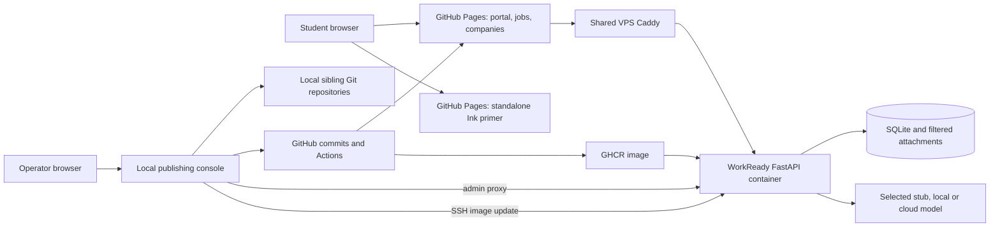

# Architecture

[Project home](../README.md) · [Configuration](configuration.md) · [Privacy](privacy.md) · [Operations](operations.md)

Baseline: API 0.3.0, reviewed 14 September 2026.

## System boundaries

WorkReady is a set of eleven sibling repositories. The [repository map](../README.md#repository-map) identifies their responsibilities. `workready-deploy` is the documentation and operations home; it does not contain all application source and is not a monorepo.

### What runs where

| Component | Current deployment |
|---|---|
| Portal and shared `session.js` | GitHub Pages, `workready.eduserver.au` |
| Job board | GitHub Pages, `seekjobs.eduserver.au` |
| Primer | GitHub Pages, `primer.eduserver.au`; independent of the API |
| Six company websites | Separate GitHub Pages sites and design systems |
| API | `workready-api` container under `~/homelab/workready` on `ssh vps` |
| TLS and public API routing | The VPS's shared `caddy` container, via Docker network `caddy_default` |
| Publishing console and lecturer page | Local operator machine, not a public website |
| Hiring-desk chat widgets | Separate AnythingLLM service, configured through `chatbot-embeds.json` |

The API is launched as uvicorn only on the shared VPS. The bundled image also contains Caddy and built static files for an alternative deployment, but that internal Caddy is not used here. `install.sh` clones nine application/company repositories during image construction. It does not clone the primer or itself, and it does not rerun when the API container starts.

The separate VPS service named `simulation-staff` is CloudCore's dashboard. WorkReady's lecturer page is served by the local console at `/admin`.

## Identity and requests

1. The lecturer issues a random contractor code. Any roster mapping stays in the lecturer's own system.
2. `POST /api/v1/auth/login` exchanges that code for an opaque, expiring bearer session.
3. Browser clients keep the session token in origin/tab-scoped `sessionStorage`. They do not use the enrolment code in subsequent request URLs.
4. `StudentRoute` in the API applies authentication and object ownership to private reads and writes. Session-kind checks prevent using an exit session as a hiring interview, for example.
5. Code revocation invalidates its student sessions on the next request. Logout invalidates the specific session. The portal also discards late callbacks and replaces the page to clear the previous user's views.

The portal, job board and company sites have separate origins and separate sessions. Students may need to enter the same issued code on each site. This is not cross-domain SSO. Public browsing remains available without a student session.

The lecturer API uses a different `WORKREADY_ADMIN_TOKEN`. The local console holds that token server-side and proxies admin requests after the operator unlocks the console. See [privacy](privacy.md) and [ADR 0003](adr/0003-contractor-codes-and-sessions.md).

## Student journey

| Stage | Student activity | Main implementation |
|---|---|---|
| 1. Browse | Optional primer, job board and fictional company research | Primer, jobs and company repositories |
| 2. Apply | Submit a synthetic PDF and cover letter; review filtered text before assessment | API `app.py`, `pdf.py`, `assessor.py`; jobs/company form handlers |
| 3. Interview | Typed conversation, with optional booking and an assessment | API `interview.py`, booking routes and portal interview view |
| 4. Placement | Mentor briefs, task submissions and feedback; coaching after task 2 passes | API `placement.py`, `task_reviewer.py`, `performance_review.py` |
| 5. Social interaction | Lunchroom invitations, slot selection, group conversation and reflection | API `lunchroom.py`, `lunchroom_chat.py` |
| 6. Exit | Reflect on the journey with HR; record the completed placement | API `exit_interview.py`, `journey_report.py` |

The six teaching stages are not a rigid six-screen wizard. Mail, Teams-style chat, tasks, coaching and lunchroom events overlap during placement.

The portal's high-level states are `NOT_APPLIED`, `APPLIED`, `INTERVIEW`, `HIRED` and `COMPLETED`. Application stage and application status are separate fields. A shortlisted student is not yet hired. Completed applications remain readable; their simulation records cannot be changed through ordinary student actions.

Task assignment defaults to three available templates, ordered by difficulty. Accepted submissions reveal later work; feedback can arrive after the next brief. A requested resubmission stays on placement rather than handing off to exit. The final handoff checks that the latest submission for every assigned task passed. Coaching is currently tied to task sequence 2, so changing the task count is not a general-purpose curriculum generator.

## Conversations and notifications

Hiring interviews, mentoring, exit conversations, colleague mail/chat and the lunchroom use the configured provider. `LLM_PROVIDER=stub` supplies development responses. A real provider must be configured explicitly; a missing cloud key or provider outage is not guaranteed to fall back safely to stub.

The personal/work inboxes and Teams-style conversation UI are simulation features. They do not send SMTP email or integrate with Microsoft Teams. `notifications.py` dispatches configured in-app notifications. Other channel names in its types are extension points, not installed integrations.

Mail/chat character context combines stored conversations with placement records and summarises older history when it exceeds a thread threshold. [ADR 0008](adr/0008-character-context-from-stored-conversations.md) records the rationale, summarisation limits and current character-matching heuristics.

Delayed presentation uses persisted timestamps: `deliver_at`, `visible_at` and `review_deliver_at`. Reads reveal eligible content; lunchroom polls can generate due character turns. There is no separate durable worker queue. Mail does use FastAPI `BackgroundTasks`, which run in the API process after a response and do not provide durable job delivery across a restart.

## Data and content

SQLite holds codes, students, session hashes/expiry, applications, stage results, messages, interviews, bookings, tasks/submissions, calendars and lunchroom records. It uses WAL mode, foreign keys and secure deletion. Filesystem erasure has a retry queue.

The deployed database is `/opt/workready/data/workready.db`; filtered mail PDFs are under `/opt/workready/data/attachments`. Both belong on the persistent volume. Web resume assessment input is transient, but its assessment is stored. Task bodies and extracted attachment text, messages and transcripts are saved. These can contain identifying material despite the use of fictional profiles.

The API loads jobs and company metadata into caches at startup. The console treats `workready-api/jobs/<company>.json` as the runtime authoring source. The loader still prefers `<SITES_DIR>/<company>/jobs.json` before the flat export, so both copies must agree when both ship.

The board fetches postings at runtime, and the API owns eligibility and confidential-posting reveal rules. [ADR 0007](adr/0007-api-owned-postings-and-eligibility.md) explains the move away from baked-in board data.

There are two distinct persona inputs:

- Hiring/mentor prompts embedded in each job's `manager_persona` field in the runtime export.
- Character prompt files under `<company>/content/employees/<slug>-prompt.txt`, used by mail/chat/lunchroom context helpers. Missing files can produce generic fallback characters.

Employee `.md` biographies are website content. Editing a biography alone does not rewrite either prompt source. The [configuration guide](configuration.md#content-sources-and-publication) explains these dependencies.

## Independent primer

The primer runs inkjs in the browser from a compiled `workready.ink.json`. It has warm, professional and playful tones, alternative-outcome explanations, card layouts and eight scene-image tags. The runtime and cartoon assets are stored in its repository. It makes no live model call to generate the story or artwork.

The player exposes completion information to a parent frame with `postMessage`. This is an integration hook, not an implemented LMS gradebook or SCORM reporting service.

[ADR 0010](adr/0010-self-contained-ink-primer.md) records the standalone story and vendored-runtime decision, including local HTTP serving and embedding requirements.

## Limits and extension points

- Each student has an individual journey; multi-student team assignments are not implemented.
- Conversations are typed; voice/video are not built in.
- Assessments are formative outputs. The journey report leaves final grading to the lecturer; see [ADR 0009](adr/0009-formative-evidence-without-an-aggregate-grade.md).
- The lecturer funnel reports latest application state by cohort. It is not a full LMS dashboard or per-lecturer access-control system.
- Timing and culture are configurable, but there is no control that makes the simulation last exactly twelve weeks.
- SQLite, one API worker and process-local budgets are the current operating model. Capacity and model cost need testing for each intended cohort size.
- Real email delivery, named lecturer accounts, institutional SSO and LMS pass-back remain future work, not accepted delivery dates.

For design rationale, see the [ADRs](adr/README.md). For the code-level API contract, use the [API README](https://github.com/michael-borck/workready-api/blob/main/README.md) and the running service's OpenAPI documentation.
